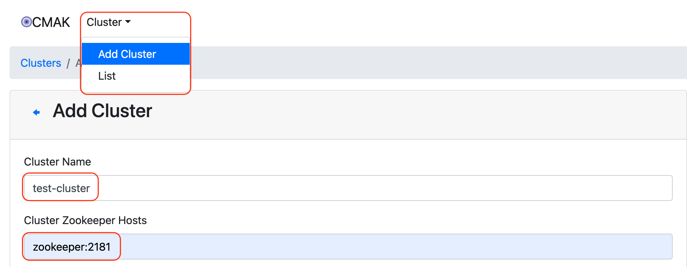
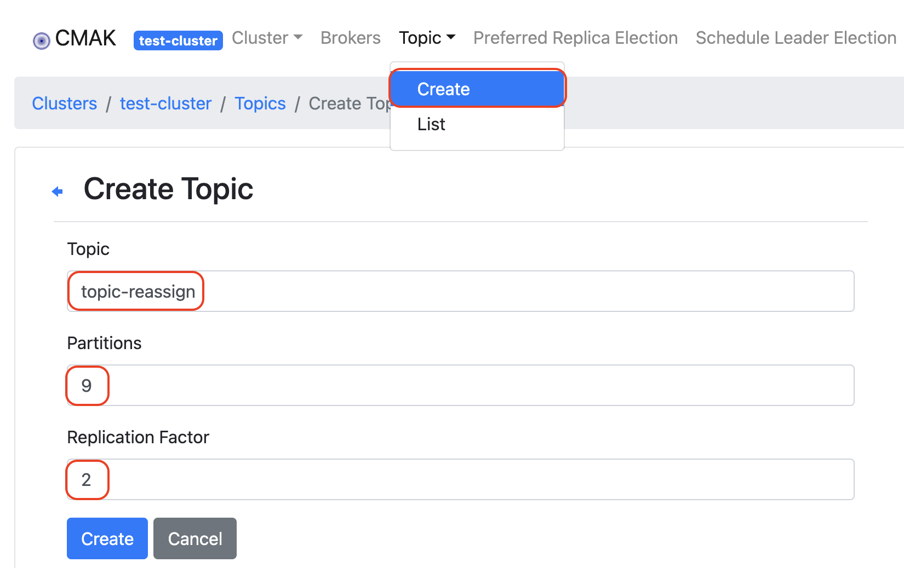
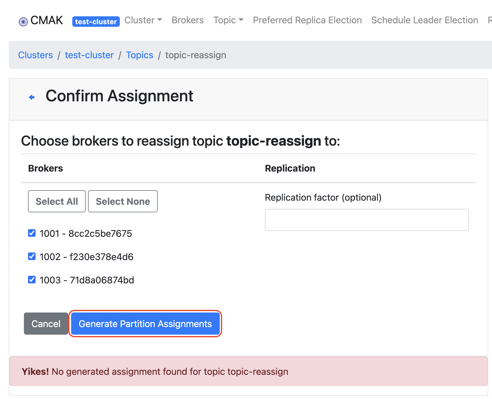
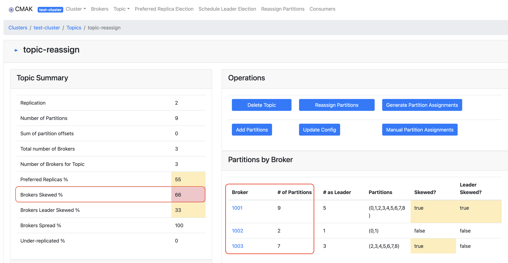
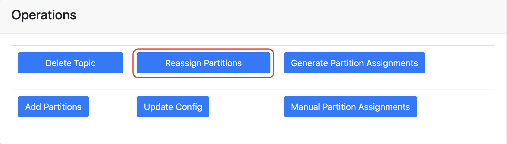
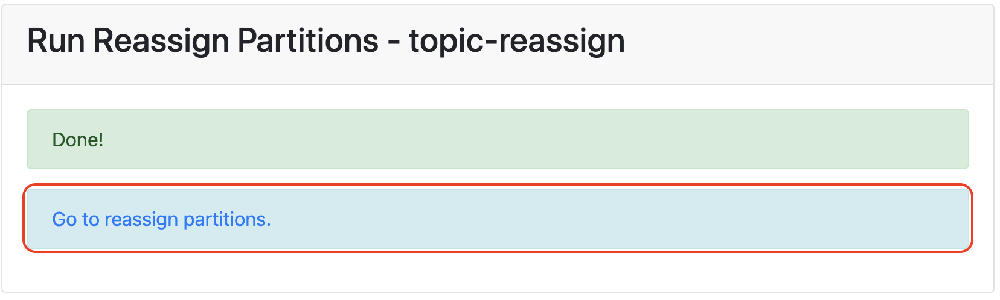
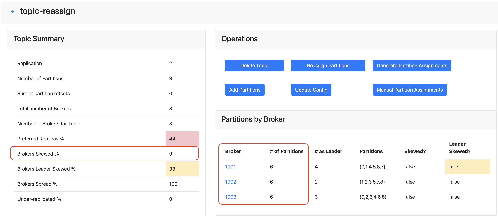

# 카프카 브로커 파티션 재할당

## 1. 배경
* 카프카를 운영하다 보면 여러 이유로 Broker Skew가 발생한다.
* 운영 중 브로커를 추가하는 경우 실제로 Broker Skew를 경험했다.
* Broker Skew가 발생했다는 것은, 브로커마다 가지고 있는 토픽들의 파티션이 균일하게 배분되지 않았다는 것이다.
  * 이 경우 메시지 생산/소비의 요청이 특정 브로커로 편향되어 브로커 리소스에 이상이 생긴다.
* 이를 해결하기 위해 브로커에게 파티션을 골고루 재할당 해주어야 한다.

## 2. 환경 만들어보기
* 다음 환경을 구성하는 가상환경을 docker-compose를 이용해 구동한다.
  * Zookeeper 1대
  * Kafka Broker 3대
  * CMAK 관리툴
  ```bash
  # 소스코드 클론
  $ gh repo clone kimheonseung/kafka-broker-partition-reassign
  
  # 소스코드 경로 이동
  $ cd kafka-broker-partition-reassign
  
  # 환경을 구성할 docker-compose 설정파일이 있는 경로로 이동
  $ cd kafka-cluster
  $ ls 
  docker-compose.yml reassign-skew.json
  
  # docker-compose를 이용하여 환경 실행
  $ docker-compose up -d
  ```
1. localhost:9000 접속
2. Cluster > Add Cluster > 아래 설정값을 기입 후 Save  
     
   * Cluster Name: test-cluster  
   * Cluster Zookeeper Hosts: zookeeper:2181  
   * 클러스터 정보 화면을 보면 3개의 브로커가 연동된 것을 확인할 수 있다.

## 3. 브로커 불균형 구현하기
* 카프카 Broker Skew 상태를 만들어본다.
* 테스트 토픽을 생성하고, 브로커별 파티션을 불균형하게 배분한다.  
1. 토픽을 생성한다.  
     
   * 토픽명 **topic-reassign**
   * 파티션은 9개, 복제본은 2개로 생성  
   * 파티션은 3대의 브로커에 나누어 떨어질 수 있도록 3의 배수로 생성
   * 복제본은 브로커의 불균형을 일으키기 위해 2개로 설정
2. CMAK에 접속하여 토픽의 파티션을 할당해준다.  
     
3. 브로커별 파티션 불균형을 일으킨다.
   ```bash
   $ docker exec kafka-cluster-kafka1-1 kafka-reassign-partitions.sh --zookeeper zookeeper:2181 --reassignment-json-file /bitnami/reassign-skew.json --execute
   ```
   

   * reassign-skew.json 파일에 명시된 것과 같이  
     1번 브로커 9개 파티션  
     2번 브로커 2개 파티션  
     3번 브로커 7개 파티션  
     총 18개 파티션을 불균형하게 나누어 갖는다.

## 4. CMAK을 이용하여 파티션 재할당하기
* CMAK에서 제공하는 자동 파티션 재할당 기능을 통해 브로커 불균형을 해소해본다.
1. CMAK 화면에서 토픽 정보 화면으로 접근한다.  
2. Reassign Partition 버튼 클릭  
     
   진행 과정은 아래 버튼으로 확인 가능하다.  
     
   잠시 후 불균형이 해소된 것을 확인할 수 있다.  
     

* 추가로 Brokers Leader Skewed 는 파티션 리더 또한 균등하게 분포하여 해결할 수 있다.
    